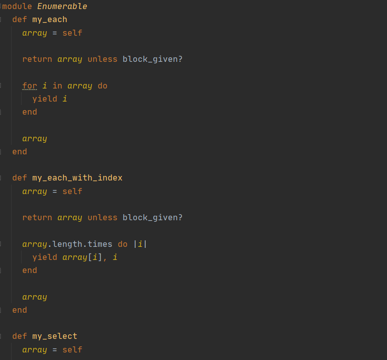

# ruby-custom-enumerables

> This is a solution to the [Odin project lesson: Enumerable methods](https://github.com/TheOdinProject/curriculum/blob/master/archive/old_lessons/ruby/basic_ruby/project_advanced_building_blocks.md#project-2-enumerable-methods). 

This is a microverse approach to replicate some of the ruby enumerable methods

## Built With

- Ruby

## Getting Started

- Run this command in your OS terminal: `git clone https://github.com/JuanDavid31/bubble-sort-by.git` to get a copy of the project.
- Open a terminal in the project folder and run `ruby app.rb`.

### Prerequisites

* Internet connection
* Having Ruby installed on you OS

### Usage

* Execute the `app.rb` file

## Authors

👤 **Author1**

- GitHub: [JuanDavid31](https://github.com/JuanDavid31)
- Github: [Juan David Piza](https://twitter.com/jdpw31)

👤 **Author2**

- GitHub: [ccobasi](https://github.com/ccobasi)

## 🤝 Contributing

Contributions, issues, and feature requests are welcome!

Feel free to check the [issues page](https://github.com/JuanDavid31/ruby-custom-enumerables/issues).

## Show your support

Give a ⭐️ if you like this project!

## Acknowledgments

- To developers, Microverse, ruby official guidelines and The odin Project

## 📝 License

This project is [MIT](https://es.wikipedia.org/wiki/Licencia_MIT) licensed.